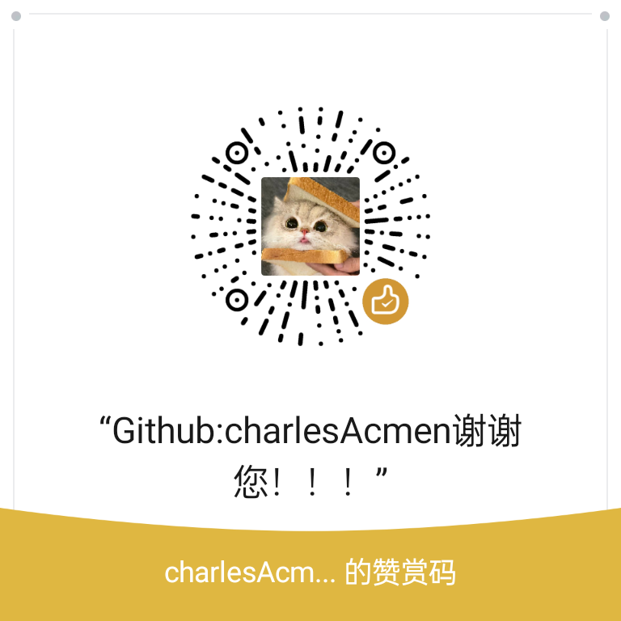

# 💖 Support This Project / 支持这个项目

[中文](#中文) | [English](#english)

---

## 中文

如果您觉得这个扩展对您有帮助，欢迎请我喝杯咖啡！☕

您的支持是我持续维护和开发新功能的动力。

### 💰 打赏方式

#### 1. 爱发电（推荐）
[爱发电](https://afdian.net) 是国内专业的创作者支持平台，类似于 Patreon。

**优势：**
- ✅ 支持月度订阅和一次性打赏
- ✅ 可以设置不同的赞助档位和回馈
- ✅ 支持微信、支付宝、银行卡等多种支付方式
- ✅ 自动管理赞助者列表
- ✅ 提供创作者主页，展示你的所有项目

> **🔗 我的爱发电主页**：**[https://afdian.net/a/charlesAcmen](https://afdian.net/a/charlesAcmen)**

 

#### 2. 微信支付

点击展开二维码

 

#### 3. 支付宝

点击展开二维码

 

---

### 🎁 赞助者权益

感谢所有支持者！你们的名字将出现在下方的赞助者名单中（需征得同意）。

**赞助档位建议：**
- ☕ **一杯咖啡**（¥5-10）：在 README 中感谢
- 🍕 **一顿午餐**（¥30-50）：在 README 和发布说明中特别感谢
- 🎉 **月度赞助**（¥10/月）：获得优先功能建议权
- 💎 **核心支持者**（¥100+）：在项目主页展示你的名字和链接

### 🌟 赞助者名单

感谢以下支持者：

<!-- 赞助者列表将在这里更新 -->
*暂无赞助者，成为第一个吧！*
---

## English

If you find this extension helpful, consider buying me a coffee! ☕

Your support motivates me to maintain and develop new features.

### 💰 Support Methods

#### 1. Afdian (Recommended for Chinese users)
[Afdian](https://afdian.net) is a Chinese creator support platform similar to Patreon.

> **🔗 My Afdian Page**: **[https://afdian.net/a/charlesAcmen](https://afdian.net/a/charlesAcmen)**
 

#### 2. WeChat Pay

Click to expand QR code

 

#### 3. Alipay

Click to expand QR code

 

---
### 🎁 Sponsor Benefits

Thank you to all supporters! Your names will be listed below (with permission).

**Suggested tiers:**
- ☕ **Coffee** ($1-5): Acknowledgment in README
- 🍕 **Lunch** ($10-20): Special thanks in README and release notes
- 🎉 **Monthly** ($5/month): Priority feature suggestions
- 💎 **Core Supporter** ($50+): Display your name and link on project page

### 🌟 Sponsors List

Thanks to these amazing supporters:

<!-- Sponsors list will be updated here -->
*No sponsors yet. Be the first!*

---

### 💬 Other Ways to Support

Even if you can't provide financial support, these are equally helpful:

1. **⭐ Star the Project**
   - Star the project on GitHub to help others discover it

2. **📣 Share & Recommend**
   - Tell your friends about this extension
   - Share on social media

3. **🐛 Report Issues**
   - Report bugs on GitHub Issues
   - Provide detailed reproduction steps

4. **💡 Suggest Features**
   - Share your ideas
   - Participate in feature discussions

5. **🔧 Contribute Code**
   - Submit Pull Requests
   - Help improve documentation
   - Translate to other languages

Thank you for your support! 🙏
感谢您的支持！🙏
